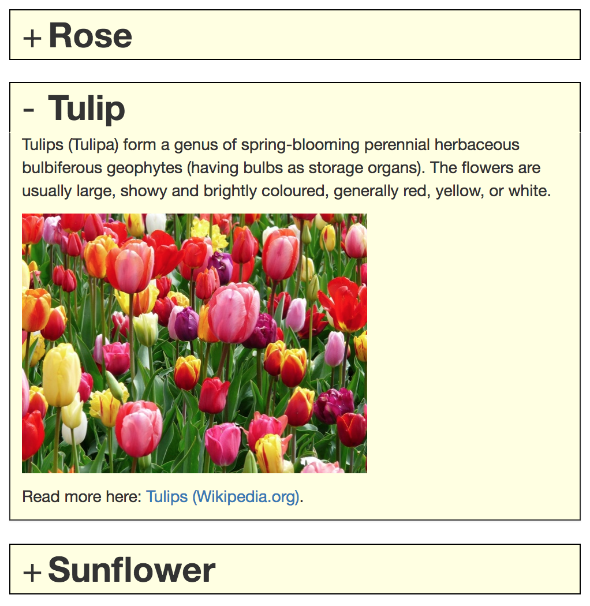

# Accordions

**Accordions contain of a number of content panels, each of wich can be expanded or collapsed vertically by the user.**

Accordions help to save vertical space and prevent from visual noise. Some accordions allow only a single panel to be expanded at a time, others allow multiple.

Before you continue, please read [Tablist widgets (or: tab panels, tabs)](/examples/widgets/tablists) to understand why accordions simply are extended variants of tablists, providing a slightly different layout and (sometimes) expandability of multiple panels.

## General requirements

The following requirements are based on well established best practices and [WAI-WAI-ARIA Authoring Practices: Accordion (widget)](https://www.w3.org/TR/wai-aria-practices/#accordion).

In addition to the tablists' requirements, and besides many other requirements, we want to stress out explicitly the following:

- Multiple slides can be visible (optional).

## Proofs of concept

### Radio buttons implementation

Based on the tablists' proof of concept, simply the layout is different.

[Example](_examples/accordion-with-radio-buttons)

#### Implementation details

Some interesting peculiarities:

- Using `.accordion:focus-within .control label`, a style can be applied to all radio button labels upon interacting with the accordion.
    - This gives users a clue that they are interacting with a single control now (indicating to use the `Arrow` keys instead of `Tab` to navigate through accordion items).
    - If you would rather like to make each control focusable on its own, you could use a group of checkboxes instead of radio buttons.
          - Do not forget to make sure only one of them is checked at a time though (using some JavaScript).

### Checkboxes implementation

Based on the tablists' proof of concept, with a slightly different layout:

[Example](_examples/multi-accordion-with-checkboxes)

#### Implementation details

Some interesting peculiarities:

- Checkboxes replace the radio buttons to offer multiple selection.
    - We waived using a `<fieldset>`/`<legend>` structure, as this is no traditional group of checkboxes, and JAWS tends to be very wordy with focusable items nested within those, see [Grouping form controls with fieldset and legend](/examples/forms/grouping-with-fieldset-legend).
- By default, only the `Space` key is used to toggle a checkbox (while pressing `Enter` submits a form).
    - To make it more intuitive for visual users (who do not know about any checkbox behind the scenes, and thinking they are interacting with a link or button), the `Enter` key was re-wired to also toggle the checkboxes.
- In contrast to the radio button solution above, we omitted a visual `.accordion:focus-within .control label` state for the accordion items, as checkboxes are individual controls and (thereby accessed by the `Tab` key, as most users would expect).

### Simple ARIA implementation

Instead of using radio buttons or checkboxes, it is relatively simple to create a custom carousel implementation with ARIA:

[Example](_examples/accordion-with-aria)

#### Implementation details

A link with an `aria-expanded="true"` attribute is placed around each panel's header; its value (`true`/`false`) and the visibility of the corresponding panel is toggled using JavaScript. See [Marking elements expandable using aria-expanded](/examples/sensible-aria-usage/expanded).

While this may feel tempting in some circumstances, there are several drawbacks:

- It needs more JavaScript (instead of relying on browser standard behaviour).
    - The current implementation allows multiple elements to be open. If you wanted to restrict it to one element though, a lot of additional JavaScript would be needed to manage states - something that radio buttons would offer "for free".
- This solution is less intuitive: a screen reader announcement "link X collapsed" is less expressive than "show panel X checkbox not checked" or "show panel X radio button not checked 2 of 3".
- Missing backwards compatibility for older clients with incomplete/missing ARIA support.
