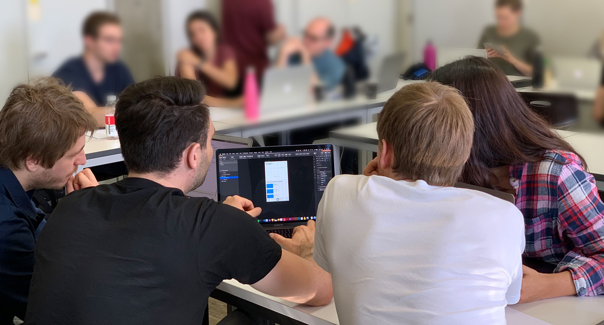

# About

Studierende Interaction Design HF (2017–2020) an der Schule für Gestaltung in Zürich.

## Unser Team
* Nils Mäder [Github](https://github.com/NMA93)
* Severin Kilchhofer [Github](https://github.com/severinkilchhofer)
* Marius Becker [Github](https://github.com/mariusbecker)
* Stephanie Fuchs [Github](https://github.com/stfffchs)
 
