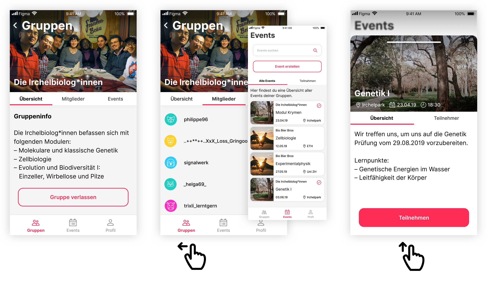
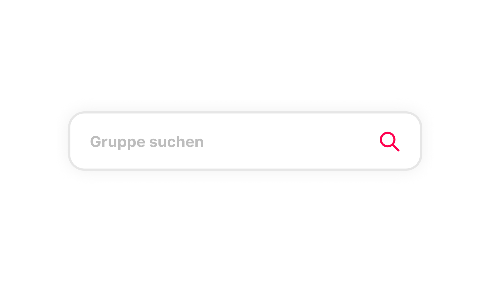

# Research

**Auch im Design ist eine Research-Phase unumgänglich. Je nach Einsatzgebiet gibt es im Designbereich unterschiedliche Benchmarks. Folgend werden unsere Gedankengänge in der Designphase genauer erläutert.**

## Trend 1 – Navigation 2.0
Der Trend geht 2019 ganz in Richtung Bottom Navigation und Gestensteuerung in Form von SwipeUp Bewegungen. Grund für diese Entwicklung sind die immer grösseren Displays, dadurch wird eine einfach erreichbare Navigation im unteren Bereich der App immer essenzieller für eine flüssige User-Experience.

## Trend 2 – Design Systeme
Eine gut fundierte Grundlage beim Aufbau eines Designs wird immer wichtiger. Durch den technischen Fortschritt werden dem User immer mehr Möglichkeiten geboten, sich durch eine App zu bewegen. Der User ist sich durch exzellent ausgearbeitete und weitverbreitete Applikationen einen immer höheren Standard gewohnt. Das Design muss nicht nur gut aussehen, es muss den User führen.

Eine gute Basis hierfür bietet ein Designsystem, welches von Anfang an zum Einsatz kommt und so gewisse Standards festlegt. Google hat mit der Material-Design-Libary eine ausgezeichnete Basis für UX-Designer weltweit geschaffen. 

Google Material Design: https://material.io/design/

## Trend 3 – Deep Flat Design
Flat Design hat für eine extremes Umdenken im Design für digitale Medien gesorgt. Einfacher, schlichter und vor allem vereinheitlicht. Dieser Trend wanderte von Icons auch auf UI-Elemente über, um dem Design wieder eine gewisse Tiefe zu geben, ist Deep-Flat ein Trend der immer mehr zum Einsatz kommt. 

Hierbei werden den Elementen mittels Schatten gewisse Floating Eigenschaften gegeben. Das Design wirkt mehrschichtig, spannender und klarer Strukturiert. 

### Quellen: 
https://uxdesign.cc/ux-trends-2019-3ddadf853ca

https://uxplanet.org/2019-ui-and-ux-design-trends-92dfa8323225