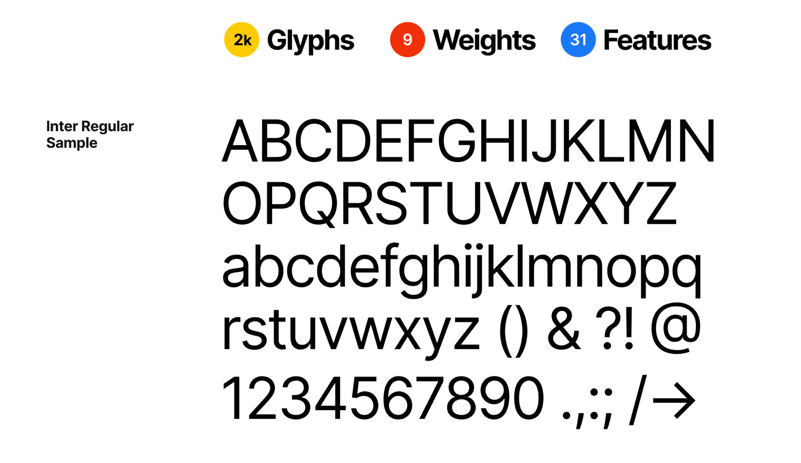
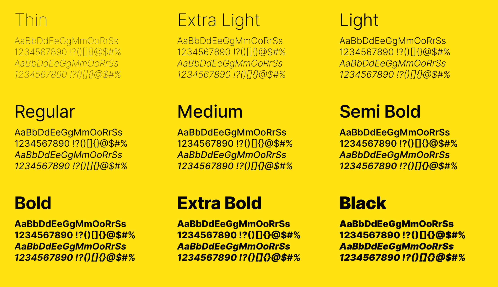

# Typografie

**Die Wahl der Schrift darf nicht unterschätzt werden. Der Font gibt dem Produkt das Gesicht. Passt die Anmutung nicht zur Applikation, wird das Produkt vom User mit negativen Eigenschaften verbunden.**

## Die Inter typeface family
Das Projekt Inter startete im Jahre 2016 und hatte das Ziel eine Pixel-Perfekte Schrift für kleine Anwendungen (11px) zu kreieren. Diese Schrift ist daher eine optimale Schrift für Display Anwendungen und deckt die Bedürfnisse modernen Applikationen mit unterschiedlichen UI-Elementen perfekt ab.

## Evaluation
In Unserer Evaluation ist die Wahl daher sehr schnell auf diesen Font gefallen. Alle unsere Vorstellungen der perfekten Schrift werden von diesem Font abgeholt. Dies Beginnt bei der relativ hohen x-Höhe welche im Mix mit Kleinbuchstaben eine bessere Lesbarkeit auf Displays gewährleistet und Endet bei der Tatsache dass diese Schrift als Opensource-Projekt auf GitHub gehostet wird.

Zusätzlich ist dieser Font mit 2000 Zeichen, 9 Schnitten und 31 Extra-Features sehr gut ausgearbeitet und ermöglicht so einen abwechslungsreichen Schriftmix innerhalb der Fontfamilie.

## Links und Rechte
Bilder: https://rsms.me/inter/

Homepage Inter: https://rsms.me/inter/

GitHub Inter: https://github.com/rsms/inter/