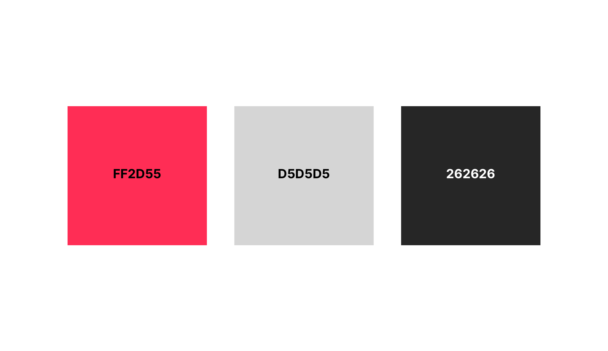
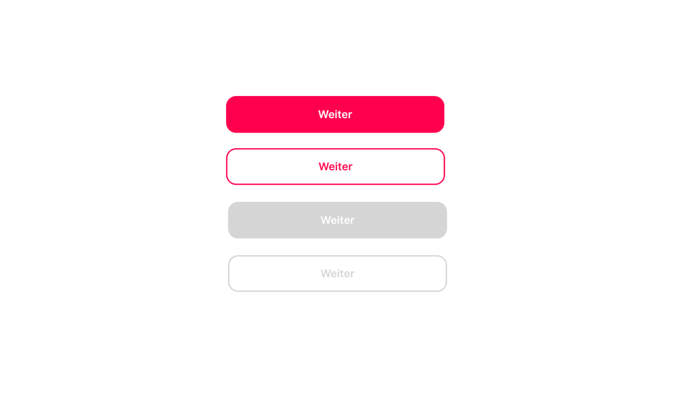
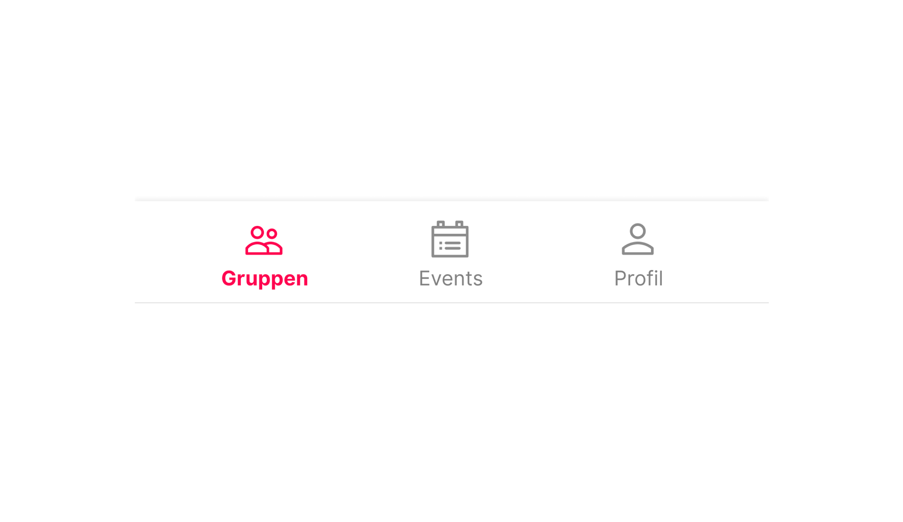
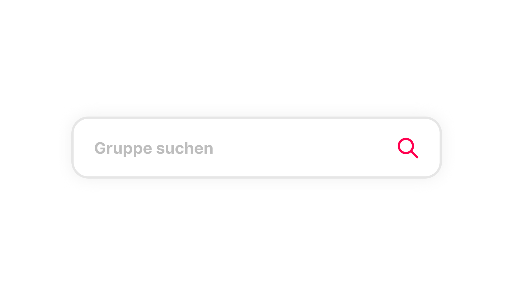
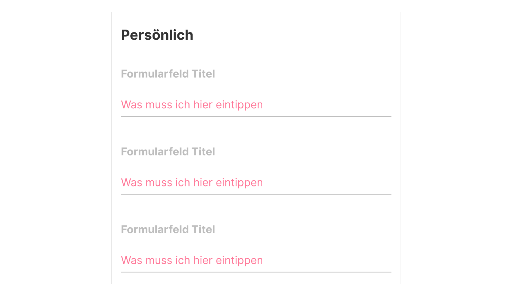
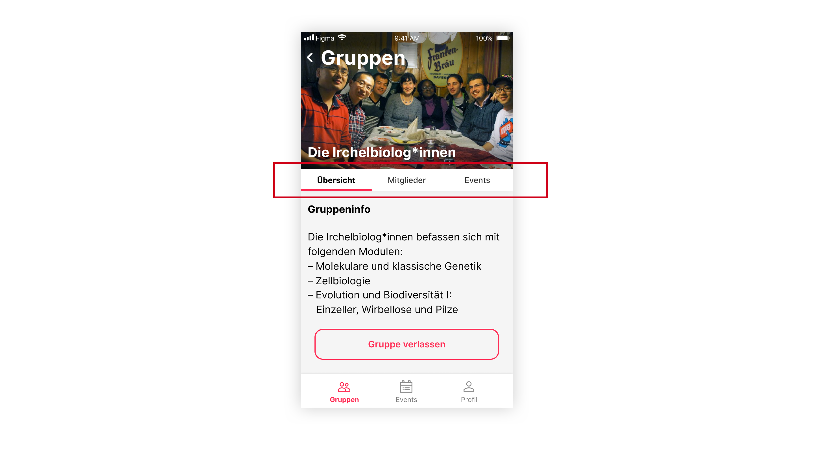
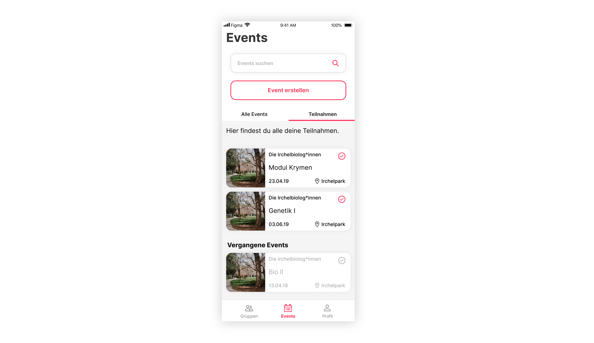
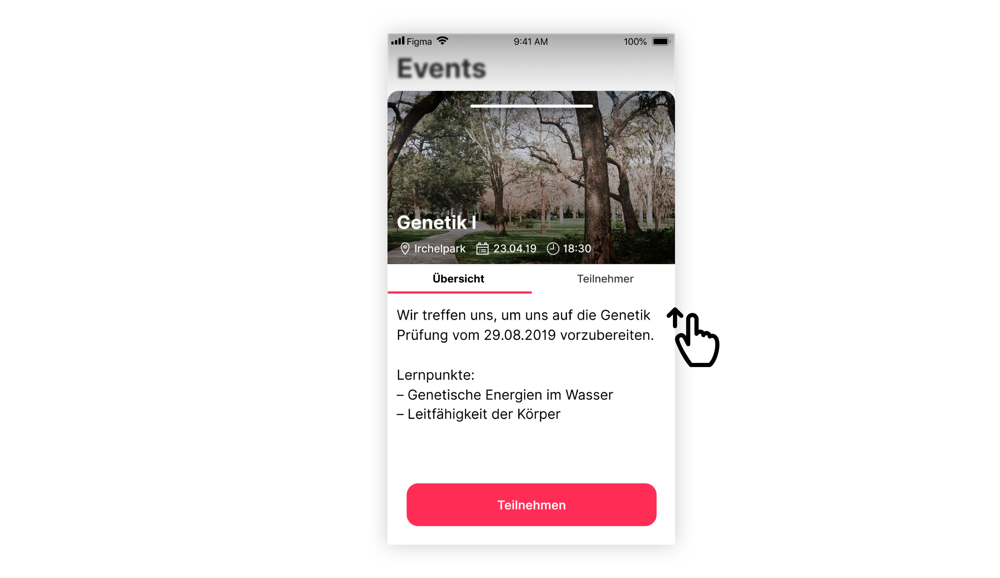

# UI Elemente / Farben

**In diesem Kapitel nehmen wir wieder Bezug zu einem der Design-Trends welcher in unserer Research erwähnt wird. Design-Systeme sind und werden immer wichtiger um den User in einem angenehmen Flow durch Applikation zu führen. Anbei gewähren wir einen kleinen Einblick in unsere Überlegungen und die Basis-Elemente.**

## Farbwahl
In unserer Farbwahl haben wir uns absichtlich zurückgehalten. Das Ziel war ein möglichst einfacher Aufbau des Designs. Daher beschränkt sich unser Design auf 3 Farben, wobei sich das Grau und Schwarz auf die Basiselemente wie Schriften und Boxen/Kacheln beschränkt. 

Als Signalfarbe haben wir ein auffälliges Pink gewählt, welches ausschliesslich bei UI-Elementen welche mit einer Aktion gekoppelt sind zum Einsatz kommen. Zusätzlich stellt diese Farbe unsere CI-Farbe dar und gibt unserem Produkt ein auffälliges Gesicht.

## UI-Elemente
Die verwendeten UI-Elemente lassen sich an einer Hand abzählen, dadurch wird die App im Aufbau sehr einfach und der User empfindet sie als sehr aufgeräumt und gut strukturiert. Nachfolgend werden wir auf alle Elemente eingehen und sie genauer erklären.

### Buttons

In unserem Design gibt es 4 verschiedene Arten von Buttons. Diese lassen sich in 2 Gruppen unterteilen: Primary- und Secondary-Buttons. 

Die Primary-Buttons werden für den User durch einen deckenden Einsatz von Farbe kenntlich gemacht. Die Secondary-Buttons hingegen beschränken sich optisch auf eine Outline.

Grundsätzlich gibt es Buttons im active Zustand und im inactive Zustand. Active Buttons werden durch die Actionfarbe ausgezeichnet, während die inactive Buttons mit Grau klar machen dass sie nicht klickbar sind.

### Navigation

Die Bottom-Navigation stellt das Herzstück unserer App dar. Durch diese kann der User durch die 3 Hauptbereiche der App navigieren. Der aktive Menüpunkt wird hierbei immer mit der Actionfarbe markiert. Die restlichen Menüpunkte sind mit Grau als inaktiv gekennzeichnet.

### Suchfeld

Das Suchfeld lässt sich vom Design her, wie beim Research-Teil erklärt, dem Deep-Flat-Trend zuordnen. Durch den Schatten hebt sich das Feld von den Buttons ab und benötigt so nur eine leichte Outline um die Sichtbarkeit auf allen Screens zu gewährleisten. Um dem User den Hinweis auf die Suche zu symbolisieren, ist ein Search-Icon in der Actionfarbe im Feld eingebetet. Zusätzlich wird im Feld selber darauf hingewiesen was hier möglich ist.

### Formfields

Die Formfields sind in ihrer Erscheinung eher einfach gehalten. Dem User soll genügend Platz geboten werden um mit den Feldern zu interagieren. Zusätzlich haben alle Felder innerhalb und ausserhalb ein Label, somit ist jederzeit klar was für Informationen beim jeweiligen Feld verlangt werden.

Zusätzlich wird hier wieder mit der Actionfarbe gearbeitet um dem User klar zu zeigen, dass hier eine Interaktion möglich ist.

### Tabs

Die Tabs ermöglichen dem User die Navigation auf einer tieferern Ebene. Hierbei kann der gesamte Inhalt mittels Klick ausgetauscht werden. Wieder wird hier die aktive Section mit der Actionfarbe gekennzeichnet.

### Event Cards

Die Eventcards ermöglichen es dem User mit aktuellen oder vergangenen Events zu interagieren. Auf den Cards findet der User diverse Informationen die einen schnellen Scann der Events ermöglichen. Durch den Deep-Flat Ansatz wird auch hier eine Klickbarkeit symbolisiert. 

Vergangene Events werden durch ausgebaute Typografie gekennzeichnet.

### Detail Card

Die Detailcards ermöglichen es dem User tiefer in ein Event oder in eine Gruppe einzutauchen. Die Detailcard wird von unten in den Viewport geschoben. Durch das gelernte Close/Card Icon am oberen Ende der Card wird dem User die Stippe-Down-Gestik, um die Card zu schliessen, näher gebracht. Zusätzlich verstärkt die Slide-Up-Animation der Card diese Gestik. 

Innerhalb der Card kann der User gewohnt mittels Tabs navigieren. Der Hintergrund wird leicht Blurred dargestellt, damit die höhere Ebene der Card klar wird. Innerhalb der Card gibt es keine Navigation, da sie über den Content geschoben wird.
