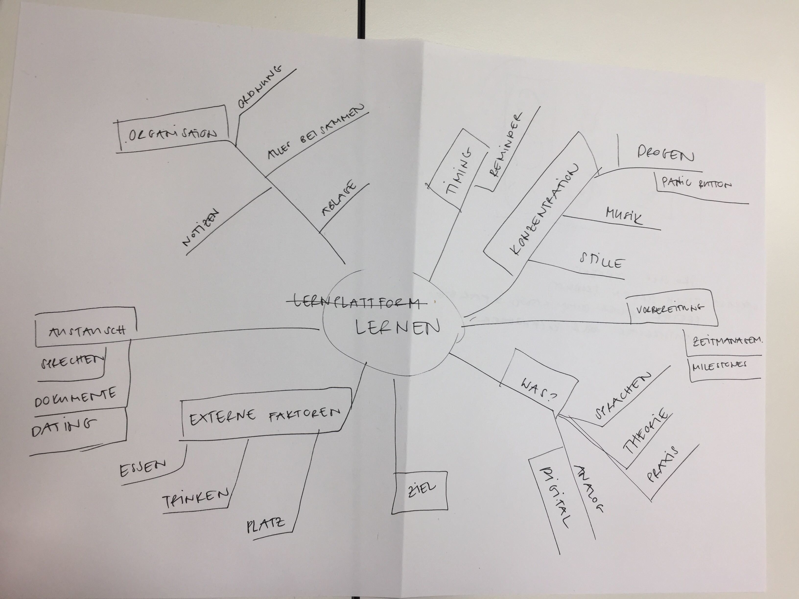

# Tag 1 – 190222

## Zusammenfassung Tag 1
### UUID Lernplattform ‘Superlearner’ Lern-Facts
#### Titel
?
#### Datum
22.02.2019
#### Gruppe
Philippa
#### Thema
HCD nach ISO 9241-210
#### Was haben wir gelernt?
Wir haben den Unterschied zwischen Usability und UX besprochen und uns einige Beispiele angeschaut. Mittels der Bedürfnispyramide können wir die einzelen Stadien einteilen. 
Wir haben besprochen welche Methoden wir anwenden können um möglichst viele hilfreichen Informationen zu sammeln. Es ist wichtig, das Szenario im IST Zustand zu beurteilen und immer wieder Feedback einzuholen, deEs gibt immer primäre und sekundäre Benutzergruppen gibt. 
1. Problem identifizieren
2. Ideen finden
3. Beste Idee auswählen und mitteilen
4. Idee ausbauen und testen
#### Was war das Highlight?
UX ist nicht nur die Nutzung auf dem UI. Das Produkt muss immer als Ganzes gesehen werden – inklusive Verpackung, Vermarktung, Phase nach der Nutzung, etc. All das zusammen ist das UX.
#### Artefakte, die wir erstellt und abgegeben haben: 
Zu zweit haben uns Gedanken gemacht wie ein MP3 Player für Vorschulkinder aussehen könnte und welche Features er haben muss. Dafür haben wir uns Bilder der IST Situation vom Umfeld angeschaut > vor Ort zu gehen und mit Betroffenen zu sprechen wäre ideal.
Für unsere Haupt-Gruppenarbeit haben wir Ideen gesammelt, ein Mindmap erstellt und alles niedergeschrieben was uns betreffend lernen eingefallen ist.
#### Was war schwierig?
Die einzelnen Schritte/Phasen richtig einzuordnen.
#### Was war das Lowlight?
Nichts spezifisches.
#### Was/wer kann euch dabei helfen?
Wir (unser Team) kann uns helfen an alles zu denken. Wollen wir HCD machen, sollten wir möglichst früh mit Betroffenen Personen sprechen und ihr Umfeld analysieren.
#### Fragen?
–