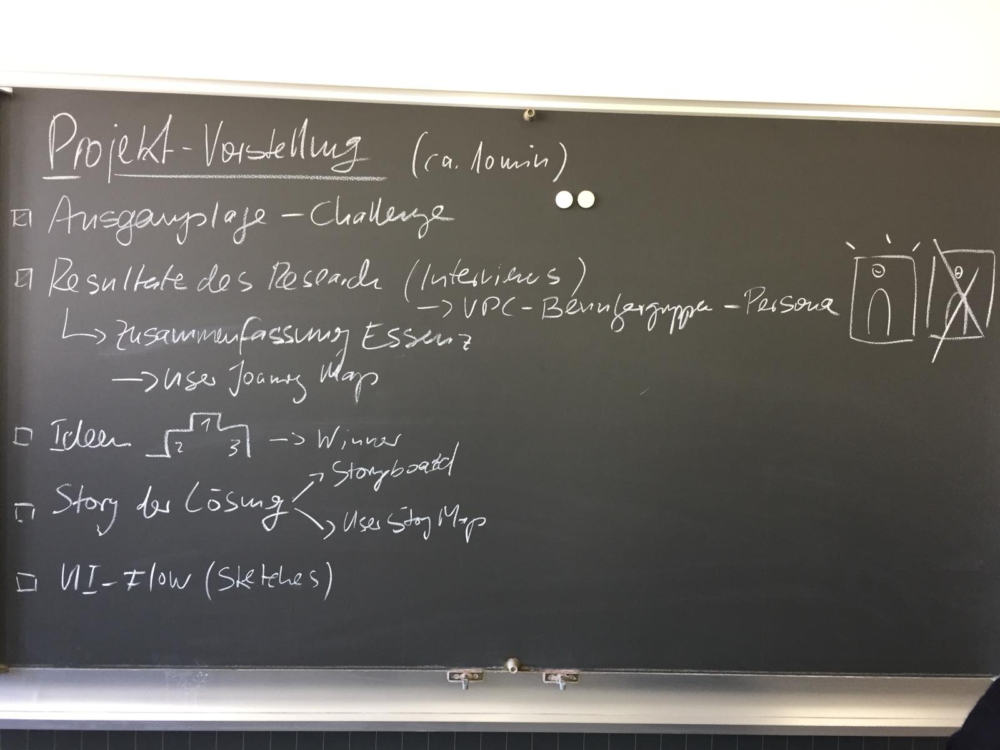

# Tag 4 – 190315 

> Projekt-Pitch (20Sek)
Titel – "Fabian" stell dir vor 'Zielgruppe' wird 'Tätigkeit', sodass 'Nutzen' und sich so fühlen 'Emotionen'.

> Fabian stell dir vor, Studenten wird lernen in Lerngruppen ermöglicht, sodass sie lernen mit sozialen Benefits verbinden können und sich glücklich fühlen.

> 

#### Tasks
Alle Gruppen pitchen ihre Apps. Nach dem Pitch erstellen wir einen ersten Wireframe Prototyp, den wir vom Paper Prototyp ableiten.

[Hier](https://docs.google.com/presentation/d/1m42qlWrGu3DFaPCe-TEAgTFd6RnvrMlh27I1n7TunEA/edit#slide=id.g528509c058_0_201) unser gesamter Pitch.
 

#### Struktur Website definiert:
* Übersicht
* Konzeption/Research
* Prototyping
* Dokumentation
* About

