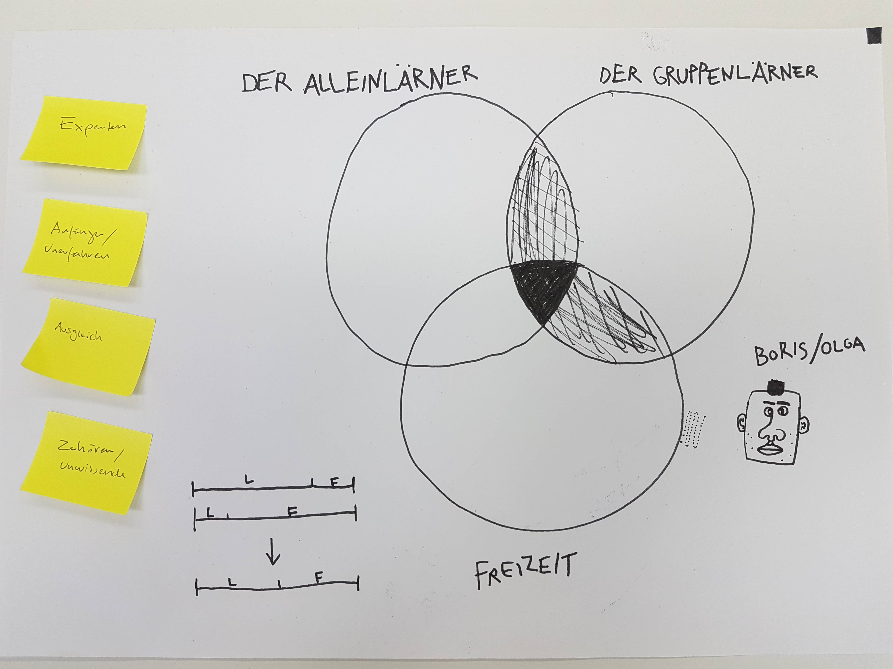

# Benutzergruppen
Um herauszufinden wer unsere Lern Applikation verwenden könnte, definieren wir zwei bis drei Benutzergruppen. Wenn wir uns diese Benutzergruppen in Kreisen aufzeichnen, ergibt sich eine Schnittmenge. Genau diese Schnittmenge ist unsere Zielgruppe. Dort wollen wir hin.

## Definiere Benutzergruppen
Es fiel uns nicht leicht, zwei bis drei Benutzergruppen zu definieren. Am Anfang notierten wir uns alle möglichen Gruppen, die uns im Zusammenhang mit Lernen und Sozialen Kontakten in den Sinn kamen. So kamen wir auf unterschiedliche Aspekte wie Gruppenlerner, Alleinlerner, Freizeitliebende, Freizeitignorierende. Allein diese vier Gruppen sind variabel kombinierbar. Mit etwas Hilfe von Armin gelang es uns schlussendlich, die Gruppen auf das Wesentliche – das Lernen – zu reduzieren.

## 1. Die Gruppenlerner
Gruppenlerner die sich gerne treffen und über gemeinsame Themen diskutieren oder gemeinsam lernen. Sie suchen zusätzliche Gruppen oder Gruppen mit Mitglieder die für sie interessant sind.

## 2. Die Alleinlerner
Diese Benutzer lernen gerne alleine aber ab und zu auch in der Gruppe. Sei es um Feedback abzuholen, ihr Wissen zu teilen oder einfach nur um zu Diskutieren. Diese müssen mehr begeistert werden um in der Gruppe zu lernen.

## 3. Der Freizeitfaktor
Beide Art von Lernenden haben etwas gemeinsam – die Freizeit. Einige achten sehr darauf, dass sie genug davon haben, während es andere nicht interessiert wieviel Freizeit sie für sich haben.

