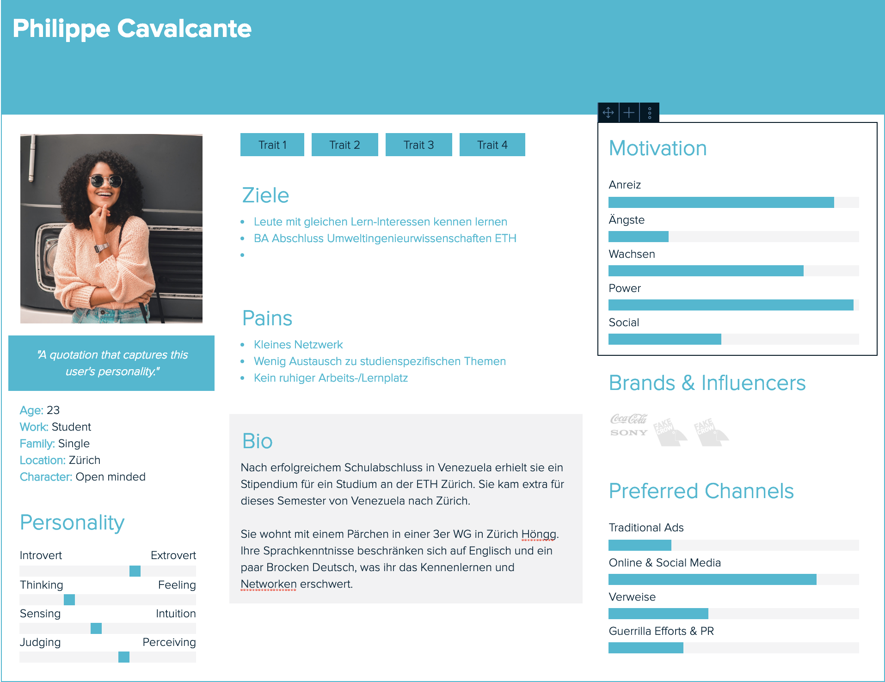

#### Benutzergruppe 1
Gruppenlerner die sich gerne treffen und über gemeinsame Themen diskutieren oder gemeinsam lernen. Sie suchen zusätzliche Gruppen oder Gruppen mit Mitglieder die für sie interessant sind.

#### Benutzergruppe 2
Diese Benutzer lernen gerne alleine aber ab und zu auch in der Gruppe. Sei es um Feedback abzuholen, ihr Wissen zu teilen oder einfach nur um zu Diskutieren. Diese müssen mehr begeistert werden um in der Gruppe zu lernen.

#### Persona

#### Szenario
Phillipe befindet sich mitten Prüfungsstress. In 2 Monaten stehene die Semesterprüfungen im Sommer an. Sie kann sich in der WG nicht konzentrieren, da es oft andere Leute in der WG hat und der Lärmpegel realtiv hoch ist. Ihr problem ist, dass sie sich in Zürich noch nicht so gut auskennt und sie somit keine ahnung ha wo sie in ruhe lernen kann. Die von der ETH bereitgestellten Lernräume sind oftmals ziemlich voll und sie findet selten einen Platz. Eigentlich würde sie am liebsten mit 2-3 anderen die für die gleiche Prüfung lernen müssen gemütlich irgendwo lernen. Doch sie weiss nicht wie sie das organisieren soll. 

#### Szenario Tätigkeiten
1. Vorbereitung Semesterprüfung
2. Diverse Lernorte ausprobieren
3. Bibliotheken aufsuchen
4. Unterlagen sichten
5. Lernpartner suchen

