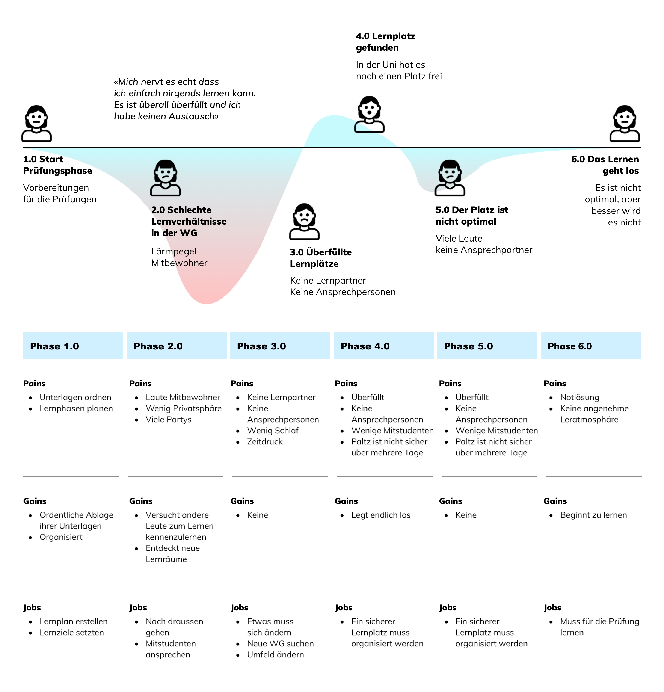

# Persona & User Journey Map
Um herauszufinden welche Personen unsere Applikation benutzen würden, erstellen wir fiktive Persona. Diese entstehen aus den vorab definierten Benutzergruppen. Wir erschaffen diese fiktive Person aus unseren Köpfen und teilen ihr Charaktere, Ziele und Überzeugungen zu.

## Philippe

### Szenario (IST)
Philippe befindet sich mitten im Prüfungsstress. In 2 Monaten stehen die Semesterprüfungen an. Sie kann sich in der WG nicht konzentrieren, da ihre Mitbewohner oft Gäste in die WG einladen und der Lärmpegel relativ hoch ist. Ihr problem ist, dass sie sich in Zürich noch nicht so gut auskennt und sie somit keine Ahnung hat wo sie in Ruhe lernen kann. Die von der ETH bereitgestellten Lernräume sind oftmals ziemlich voll und sie findet selten einen Platz. Eigentlich würde sie am liebsten mit zwei bis drei anderen Studierenden, die für die gleiche Prüfung lernen müssen, gemütlich irgendwo lernen. Doch sie weiss nicht, wie sie das organisieren soll.

### Szenario Tätigkeiten
1. Vorbereitung Semesterprüfung
2. Diverse Lernorte ausprobieren
3. Bibliotheken aufsuchen
4. Unterlagen sichten
5. Lernpartner suchen

## User Journey Map
### IST-Zustand

### SOLL-Zustand

