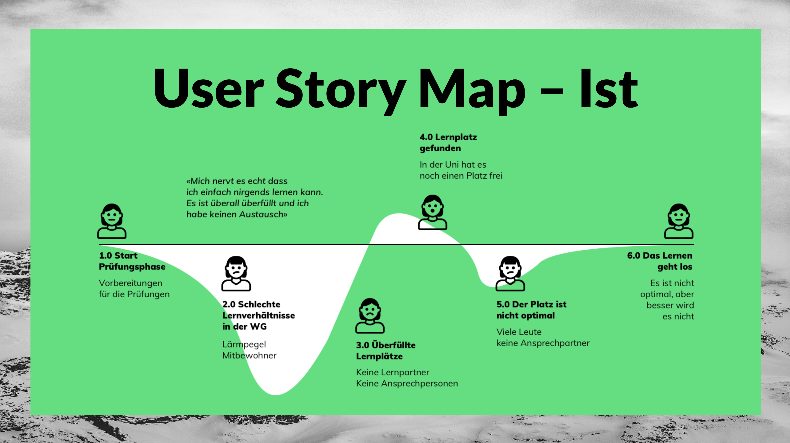
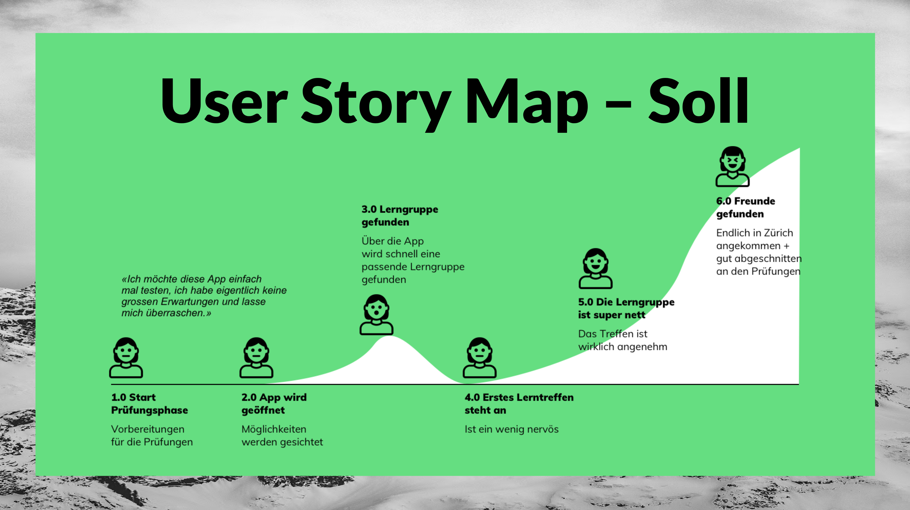

# Pitch
**Beim Pitch ging es darum unsere Idee möglichst gut zu verkaufen. Dabei mussten wir vor allem den Research- und Konzeptions-Teil möglichst fresh und verständlich aufzeigen. In diesem Kapitel weden die Punkte unseres Pitches genauer aufgezeigt.**

## Ausgangslage
Im Zentrum unserer Ausgangslage steht unser Leitsatz: **«Wie können wir den Studierenden helfen, Lernen mit sozialen Benefits zu verbinden.»** An diesem werden wir uns während dem ganzen Projekt orientieren.

In diesem Teil wurden auch die VPC's vorgestellt, und zwar unsere eigenen und die der befragten Personen.

## Research
Im Abschnitt Research unsere Präsentation haben wir die diversen Methoden vorgestellt die uns geholfen haben ein Bild der IST- und SOLL-Situation zu machen.

### Folgende Methoden wurden vorgestellt:
* Interviews
* VPC's
* Benutzergruppen
* Persona

## Idee
 
In diesem Abschnitt ging es darum unsere Idee möglichst einfach verpackt dem Publikum näher zu bringen. Bei einem Pitch ist es wichtig nur das nötigste, dafür aber das richtige zu zeigen. Wir beschränkten uns auf einfache Grafiken die von uns mündlich ergänzt oder erklärt wurden.

## Story der Lösung
Hierbei wurde der IST- und SOLL-Zustand genauer aufgezeigt. Dabei wird ein typischer User-Flow mit den aktuellen Problemen aufgezeigt und dieser mit dem optimalen User-Flow verglichen der nur in Kombination mit unserem Produkt entstehen kann.

 
In dieser Grafik ist der IST-Zustand abgebildet. Es ist eine klar unbefriedigende Tendenz zu erkennen.

 
In der SOLL-Grafik ist die Kurve deutlich von Erfolgserlebnisen geprägt und zeigt eine insgesamt bessere User-Experience.

## UI-Flow
In Diesem Abschnitt wurden die Requirement und der Userflow nochmals vorgestellt. Hierbei gint es darum aufzuzeigen was wir für Anforderungen an unser Produkt stellen werden.

## Link zur Präsentation
Unseren Pitch und unsere Vision in eine Präsentation gepackt kannst du [hier](https://docs.google.com/presentation/d/1m42qlWrGu3DFaPCe-TEAgTFd6RnvrMlh27I1n7TunEA/edit#slide=id.p) sehen.

 
