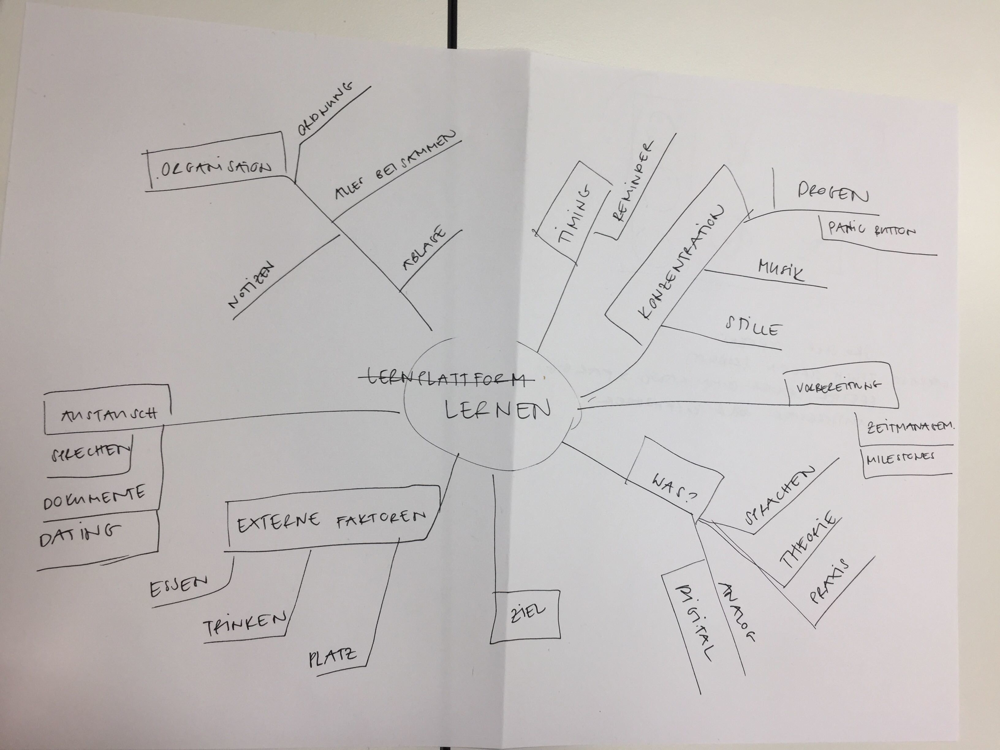

# Human Centered Design nach ISO 9241-210

22.02.2019 – Wir steigen ein in das Modul Human Centered Design. Was ist der Unterschied zwischen Usability und UX? Die Bedürfnispyramide von Jesse James Garret hilft uns diese in die einzelnen Stadien einzuteilen. Was gibt es für Methoden um hilfreiche Informationen zu sammeln? Das IST-Szenario wird beurteilt und Feedback eingeholt.

## Was haben wir gelernt?
Wir haben den Unterschied zwischen Usability und UX diskutiert und uns einige Beispiele, sowie Usability-Fails angeschaut. Mit Usability ist die Benutzerführung gemeint – wie Benutzerfreundlich die Website oder das Produkt ist. Das UX ist die Benutzererfahrung – was der Benutzer erlebt wenn er auf einer Website ist oder z.B. ein Produkt bedient.


```html
Usability + User Experience = «mach das mal schön»
```
    
Mittels der Bedürfnispyramide von Jesse James Garret können wir die einzelnen Stadien der Entwicklung einteilen. Wir haben besprochen welche Methoden wir anwenden können um möglichst viele hilfreiche Informationen zu sammeln. Es ist wichtig, das Szenario im IST-Zustand zu beurteilen und immer wieder (!) Feedback einzuholen. 

### Die Herangehensweise
1. Problem identifizieren
2. Ideen finden
3. Beste Idee auswählen und mitteilen
4. Idee ausbauen und testen


## Highlight & Lowlight
### Das Highlight
UX ist nicht nur die Nutzung auf dem UI. Das Produkt muss immer als Ganzes gesehen werden – inklusive Verpackung, Vermarktung, Phase nach der Nutzung, etc. All das zusammen ist das UX.

### Das Lowlight
Welches Lowlight? :)

## Artefakte, die wir erstellt & abgegeben haben
Zu zweit haben wir uns Gedanken gemacht wie ein MP3 Player für Vorschulkinder aussehen könnte und welche Features er haben muss. Dafür haben wir uns Bilder der IST-Situation vom Umfeld angeschaut. Sich vor Ort zu begeben und mit Betroffenen zu sprechen wäre ideal. So können wir die Needs der Benutzer eruieren indem wir mit diesen sprechen und aktiv beobachten.

Für unsere Haupt-Gruppenarbeit, die Lern-App, haben wir Ideen gesammelt, ein Mindmap erstellt sowie alles niedergeschrieben was uns betreffend Lernen eingefallen ist.



Die AEIOU-Methode bei welcher Aktivitäten (Activities), Umfeld (Environment), Interaktion (Interaction), Gegenstände (Objects) und Nutzer (User) definiert werden, haben wir nicht angewendet.


## Schwierigkeiten & Fragen
### Schwierigkeiten
In der Findungsphase wären die Enduser die richtigen Ansprechpersonen. Für unser Projekt können und müssen wir uns selber helfen und nehmen dankend die Hilfe von Armin entgegen. Die einzelnen Schritte/Phasen richtig einzuordnen hat uns doch ein wenig struggeln lassen.

### Fragen
Wir haben ganz viele Fragen, jedoch können wir diese nicht alle heute beantworten.


