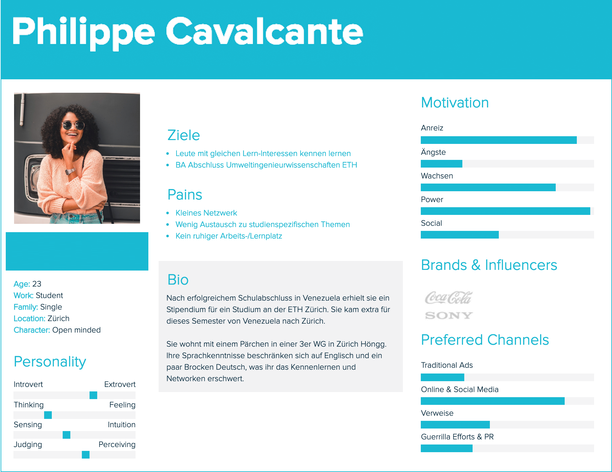

# Challenge, Interviews & Persona

01.03.2019 – Wir definieren eine Challenge. Anhand dieser erstellt jeder seine persönliche Value Proposition Canvas, kurz VPC. Wir vergleichen unsere Pains, Gains und Jobs um daraus Fragen für die bevorstehenden Interviews zu generieren. Die Antworten der Interviews ermöglichen uns Benutzergruppen zu erstellen und Persona zu kreieren.

## Was haben wir gelernt?
Nach einer kurzen Repetition vom ersten Tag haben wir im ersten Input gelernt wie man ein offenes Interview aufbaut und wie wir den Interviewpartnern geschickt ihre Pains, Gains & Jobs entlocken können. Als Basis für unsere Fragen notierten wir unsere eigenen Pains, Gains und Jobs, die wir anschliessend verglichen haben und daraus unsere Challenge formulierten.

```html
«Wie können wir den Studierenden helfen, 
Lernen mit sozialen Benefits zu verbinden.»
```
### VPC & Interviews
Für unser erstes Interview hat sich Marc bereit erklärt. Dank seinem Einverständnis durften wir ihn auch Filmen, was uns im Nachhinein ermöglichte, unklarheiten aus dem Weg zu schaffen. Seine Aussagen halfen uns, die Fragen für unser zweites Interview mit Nicole besser formulieren. 
Nach den Interviews konnten wir diese auswerten. Wir bündelten ihre Aussagen wiederum in Pains, Gains und Jobs und verglichen diese wieder mit unseren eigenen.

### Benutzergruppen
Bei der Definition der Benutzergruppen haben wir uns etwas den Kopf zerbrochen. Viele solche zu erstellen ist kein Problem, sie aber auf zwei bis drei zu reduzieren macht es schwieriger. Gehen wir von Allein-/Gruppenlernern aus oder von Personen die viel Freizeit haben (wollen) und solchen die nicht viel Freizeit brauchen? Wir einigten uns auf die Alleinlerner, die Gruppenlerner und den Aspekt Freizeit als gemeinsame Mitte.


### Persona
Im zweiten Input gingen wir auf die Persona ein, welche wir danach anhand der Benutzergruppen definierten. Mit dem Tool von Xtensio konnte einfach eine Persona erstellt werden.



### Szenario
Um ein mögliches Szenario mit allen Vor- und Nachteilen aufzeigen zu können, definierten wir ein IST-Szenario mit einzelnen Milestones. Jeder Milestone erhielt wiederum Pains, Gains und Jobs. Dasselbe machten wir für das SOLL-Szenario.

## Highlight & Lowlight
### Das Highlight
Am spannendsten waren die Interviews. Es wurden Dinge angesprochen, an die wir selber nicht gedacht hatten. Auf diese konnte wir dann gezielt eingehen und nachhaken.

### Das Lowlight
Der Zeitplan war schon sehr sportlich. Es ist schwierig in solch kurzen Sprints sich in eine neue Materie zu vertiefen.

## Artefakte, die wir erstellt & abgegeben haben
Wir haben unsere persönlichen Pains, Gains & Jobs aufgeschrieben. Anhand dieser haben wir Fragen für die Interviews notiert. Wir führten zwei Interviews uns haben die Aussagen miteinander und mit unseren verglichen wobei wir aus den Antworten vom ersten Interview die Fragen für das Zweite angepasst haben. Danach wurden die Benutzergruppen definiert und daraus eine Persona erstellt.
## Schwierigkeiten & Fragen
### Schwierigkeiten
Wir taten uns schwer damit Benutzergruppen zu definieren.

### Fragen
Keine
