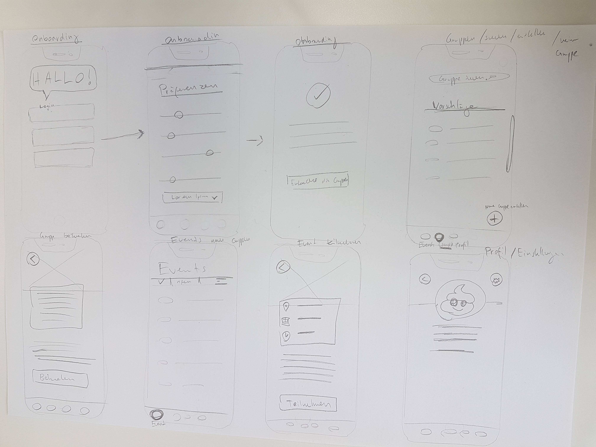

# Lösungsformen, Ideation & Praxisbeispiele

08.03.2019 – Sei ein Visionär! Eine gute Vision überzeugt und lässt den Kunden kaufen/investieren. Kreatechniken bringen uns erneut auf Ideen welche unser Projekt optimiert. Das Storyboard wird gezeichnet und die User Story Map an die Wand gepostet.

## Was haben wir gelernt?
### Vision & Kreatechniken
Wir haben gelernt dass eine überzeugende, mitreissende Vision der Schlüssel ist um das Produkt zu vermarkten. Diese definieren wir anhand des Golden Cyrcle – 1. Why, 2. How, 3. What. 

```html
«Von Tweets, über Fischen zur Vision»
```
Die Challange muss genau beschrieben um das Problem lösen zu können. Armin hat uns mehrere Kreatechniken vorgestellt, die uns bei der Lösung unseres Problems helfen werden. Wir konnten das Worstcase-Szenario, Brainwriting sowie CrAzY 4 anwenden und so besser kennenlernen.

###  Storyboard, Userflow & User Story Map
Wir erstellen ein Storyboard und konnten daraus einen Userflow ableiten. Dank diesen Schritten konnten die User Story Map gemacht werden. Es ist wichtig, dass wir die Epics und Features aus Sicht des Users zu beschreiben. Man muss sich schon sehr früh Gedanken über alle nötigen/möglichen Funktionen machen.



## Highlight & Lowlight
### Das Highlight
Uns hat das Worstcase Szenario bei den Krea-Techniken sehr gut gefallen. Vom Schlimmsten auszugehen ist ein neuer Ansatz, den wir noch nicht gekannt haben.

### Das Lowlight
Einige Krea-Formen eignen sich nicht für alle Teams.

## Artefakte, die wir erstellt & abgegeben haben
Wir haben unsere Vision in einen Tweet gepackt und kurz präsentiert. Anhand der ausgewählten Kreatechniken konnten wir unsere Challenge präziser definieren und ein Storyboard erstellen. Wir skizzierten einen möglichen Userflow und posteten davon abgeleitet die User Story Map an die Wand. Die einzelnen Tasks wurden in Epics und Features aufgeteilt.
## Schwierigkeiten & Fragen
### Schwierigkeiten
Wir hatten mühe die Epics und Features aus Sicht des Users zu definieren da wir immer wieder in die Entwicklersicht abrutschten und der Zeitplan sehr sportlich war.

### Fragen
Keine
