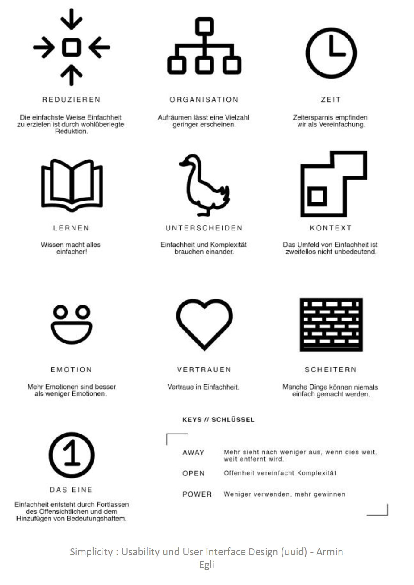

# Pitches & Designgrundlagen

16.03.2019 – Der erste grosse Moment ist da, wir Pitchen unsere Lern App. Ein neuer Dozent welcher noch nichts von unserer App weiss will überzeugt werden in dieses Teil zu investieren. Es folgt ein Input über Designgrundlagen. Mit diesem Wissen beginnen wir mit dem ersten Wireframe, bzw. LoFi Prototype.

## Was haben wir gelernt?
Wir sehen uns drei Designgrundlagen genauer an. In Gruppen haben wir uns in die Dialoggestaltung, die Gestaltungsgesetze und Simplicity vertieft. Anschliessend präsentierten wir diese in einer Kurzform. Es ist wichtig, sich an mindestens eines dieser Gesetze zu halten um für die Struktur und das Design argumentieren zu können. 

### Die Dialoggestaltung 
Durch die international bekannte FISALES Eselsbrücke können wir und die sieben Designgrundlagen merken.

F-I-S-A-L-E-S
1. Fehlertoleranz
2. Individualisierbarkeit
3. Selbsterklärungsfähigkeit
4. Aufgabenangemessenheit
5. Lernförderlichkeit
6. Erwartungskonformität
7. Steuerbarkeit

```html
«Fritz Isst Seine Aprikosen Lieber Essig Sauer» 
Anonymous
```

### Informationsarchitektur & Gestaltgesetze
Architektonisch gruppieren wir Elemente wie folgt:
1. Ähnlichkeit
2. Nähe
3. Prägnanz
4. Geschlossenheit
5. Kontinuität
6. Gemeinsames Schicksal
7. Gemeinsame Regionen
8. Verbundenheit

BILD Gestaltungsgesetze

### Simplicity
Die Simplicity Gestaltungsgesetze wurden von John Maeda ins Leben gerufen. Dabei geht es um die maximal nötige Reduzierung von Elementen. Das Endprodukt soll einfach zu verstehen und zu bedienen sein.



## Highlight & Lowlight
### Das Highlight
Die «Stand-up» Vorträge der einzelnen Gruppen über die Gestaltungsgesetze waren sehr interessant sowie amüsant. Nicht weniger interessant waren natürlich die Pitches der Lerngruppen.

## Das Lowlight
Welches Lowlight? :)

## Artefakte, die wir erstellt & abgegeben haben
Neben der Präsentation die wir für den Pitch auf diesen Tag vorbereitet hatten, haben wir mit dem Wireframing begonnen. Dazu müssen wir jedoch sagen, dass aus dem Wireframe schnell ein LoFi-Prototype geworden ist, da wir wie immer sportlich unterwegs waren und der Zeitplan uns nichts schenkte.

## Schwierigkeiten & Fragen
### Schwierigkeiten
Als wir mit dem Wireframe begonnen haben, kamen mehrere Fragen betreffend Hierarchie auf. Es war etwas knifflig da alles zu bedenken und asap eine geordnete Struktur zu erstellen.

### Fragen
Keine
