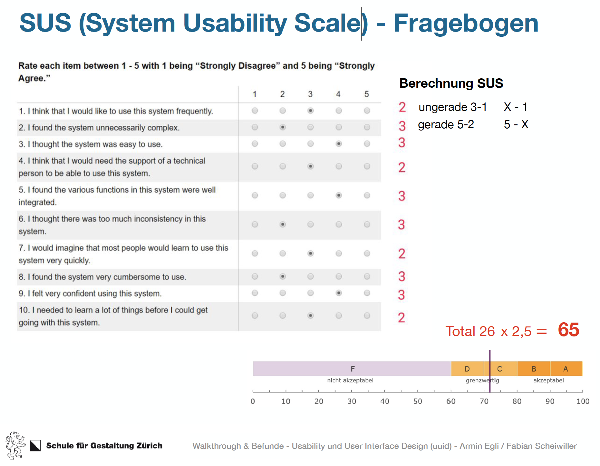

# Usability Walkthrough, SUS & EMO-Cards
22.03.2019 – Guerilla Testing heisst der erste Stop. Inputs erklären uns den Ablauf eines realen Usability Walkthrough. Das Briefing bereitet die Testpersonen vor. Der Walkthrough wird von einer Person geleitet. Videos oder Audios sind willkommen. Post-Interviews, EMO-Cards oder der SUS Fragebogen schliesst den Walkthrough ab.

## Was haben wir gelernt?
Wir lernen das Guerilla Testing kennen und schauen diesbezüglich ein paar reale Usability Walkthroughs an. Idealerweise plant man mehrere Walkthoughs mit jeweils fünf Personen. Die Wahrscheinlichkeit, dass diese fünf Personen verschiedene Ansichten haben ist gross. Die Wahrscheinlichkeit, dass mehr Tester mehr unterschiedliches Feedback bringen, wird immer kleiner.

### Usability Walkthrough
Das Wichtigste ist wohl die Vorbereitung. Wir müssen gezielt unsere Fragen zum Prototypen stellen können um gezielt Feedback zu erhalten. Bevor wir starten erklären wir worum es genau geht und das wir nicht die Person an sich, sondern unser Produkt testen wollen. Die Testperson kann also nichts falsch machen und auch keine blöden Fragen stellen. Stellt sie uns doch Fragen, stellen wir ihr eine Frage zurück. Was erwartet die Person was passiert?

```html
«Paper Prototype oder Digital Prototype?»
```

Je nachdem was wir testen wollen, eignet sich ein Prototyp aus Papier besser oder schlechter. Geht es um Abläufe, Funktionalität oder Terminologie kann gut damit getestet werden. Im Bereich vom Look & Feel, dynamischen Aspekten und Grössen von Elementen sollte man jedoch besser eine digitale Variante vorlegen.

## Testing & Post-Interview
Die Testings liefen ganz gut. Wir haben gelernt auf die Testpersonen einzugehen und gezielt Informationen herauszufiltern. Wichtig ist, immer offen zu bleiben und noch einmal – dem Tester keine Antworten in den Mund zu legen. Bei den Post-Interviews bekamen wir gutes Feedback, soweit haben wir einiges richtig gemacht.

## EMO-Cards & SUS Fragebogen
Wir lernten, wie man die EMO-Cards anwendet. Diese werden ausgelegt und die Testperson kann sich drei aussuchen. Zu diesen drei Karten gibt sie uns dann Feedback, welches uns wiederum weiterhilft. Bei dem SUS Fragebogen Stellen wir den Testern gezielte Fragen (siehe SUS Fragebogen unten). Diese werden danach ausgewertet und anhand dieser Wertung sahen wir, ob wir mit unserem Projekt auf dem richtigen Weg sind – was wir waren – oder ob wir alles noch einmal überdenken müssen.


## Highlight & Lowlight
### Das Highlight
Die «Stand-up» Vorträge der einzelnen Gruppen über die Gestaltungsgesetze waren sehr interessant sowie amüsant. Nicht weniger interessant waren natürlich die Pitches der Lerngruppen.

## Das Lowlight
Welches Lowlight? :)

## Artefakte, die wir erstellt & abgegeben haben
Wir habe den LoFi Prototyp fertiggestellt und zweimal getestet. Post-Interviews wurden geführt und der SUS (System Usability Scale) Fragebogen sowie das EMO-Card Feedback wurde eingeholt und ausgewertet.

## Schwierigkeiten & Fragen
### Schwierigkeiten
Wir konnten uns nicht auf die einzelnen Testpersonen vorbereiten. Man muss immer etwas auf seine Notizen spicken, um die gewünschte Information vom Tester zu erhalten und nicht abzuschweifen.

### Fragen
Keine
