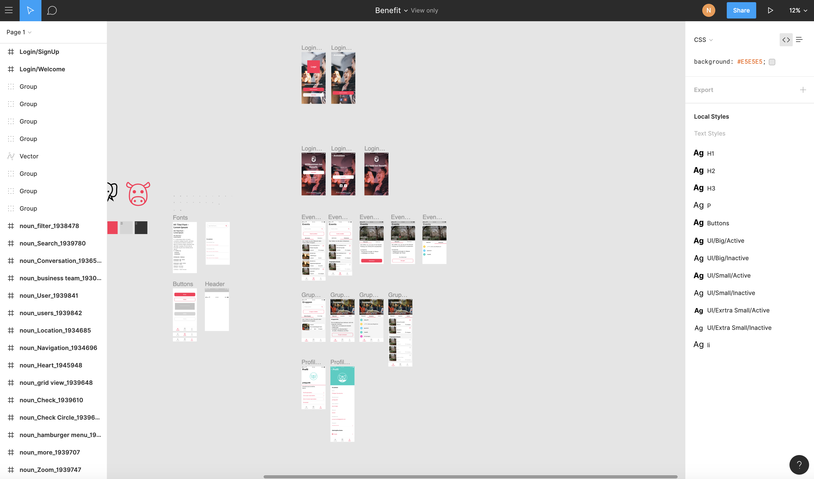

# HiFi – Prototype
**Das Design steht im HiFi Prototype grundsätzlich. Die Applikation hat eine klare Sprache und es geht jetzt darum Fehler im UI aufzudecken.**

## Ziele & Eigenschaften eines HiFi-Prototypen
Sie zeigen das Verhalten des echten System in interaktiver Form,  statt nur mit statischen Screens. Dadurch kann dem User schon in einem frühen Stadium das Verhalten eines Systems nähergebracht werden.

 HiFi Prototypen können mit den richtigen Tools sehr schnell gebaut werden. Dadurch kan schon in einem frühen Stadium des Designs ein User-Feedback eingeholt werden.
 
Prototypen können auch aus HTML/CSS und JavaScript erstellt werden. Dies hat den Vorteil das gewisse Transisitons die für das UX eines Systems wichtig sind, getestet werden können.

## Struktur

Die Struktur unterscheidet sich nicht vom LowFi-Prototypen. Es wurden in einem ersten Testin keine grundlegenden Fehler aufgedeckt. Daher war es auch nicht notwendig daran etwas zu ändern.

## Der Prototype

Das von uns erarbeitet Design wurde Konsequent in unseren Prototypen eingebaut. Dadurch konnten wir eine stets konsequente Sprache in unsere Applikation gewährleisten.

Auf Basis des LowFi-Prototypen konnten wir so die einzelnen Screens gemeinsam ausarbeiten.

[Zum HiFi-Prototype](https://www.figma.com/proto/RECJuTUBg0xR3bLLu1yByFAr/Benefit?node-id=92%3A649&scaling=scale-down)

