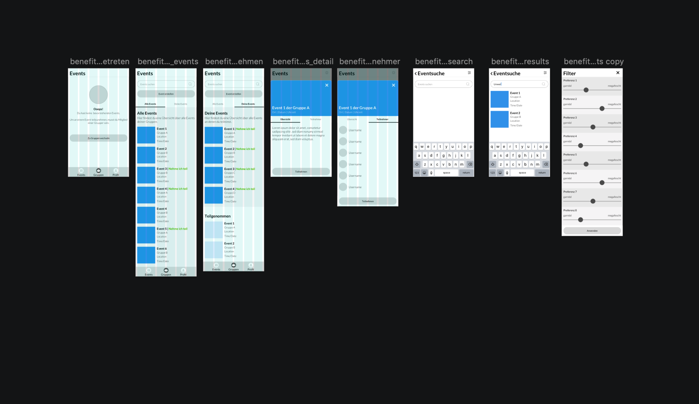

# Wireframes
**Mitt den Wireframes oder dem LowFi-Protoype können schon erste User-Testing durchgeführt werden. Somit können in einem frühen Stadium bereits strukturelle Fehlüberlegungen festgestellt werden.**

## Struktur unf Aufbau – Flow Chart

Unser Prototype hat insgesamt 3 Ebenen. Der User kann auf der Hauptstufe zwischen den 3 Hauptpunkten navigieren. Unter jedem Punkt kann der User 1 Stufe tiefer gehen und dort innerhalb einer Card den Content wechseln.

## LowFi Prototype

Folgend ist unser LowFi-Prototype verlinkt. Mittels diesem Wireframe haben wir ein erstes User-Testing durchgeführt und konnten schon erste gravierende Fehler feststellen. 

[Wireframe Prototype](https://notch-interactive.invisionapp.com/share/GKR1N2D6CWU#/screens/352596569_benefit-Onboarding)

### Erkentnisse aus dem LowFi-Testing
Folgende Fehler sind während dem LowFi-Testing ausfindig gemacht worden.

#### Einstellungen

Die Eisntellungen werden als unnötig emfpunden. Es ist nicht klar wofür diese zuständig sind, da unten das Profil immer erreichbar ist.

#### Profilbild

Dem User war nicht klar ob er das Profilbild bearbeiten kann oder nicht. Eine Lösung könnte ein Bearbeiten-Icon sein.

#### Gleiche Bedeutung

Dem User war der Unterschied zwischen Suche und Secondary-Button nicht klar. Die Lösung für dieses Problem kann im Design erarbeitet werden.

#### Wording

Das eher strenge Wording auf dieser Seite verunsicherte den User. Dem User war nicht klar ob er hier einen Fehler gemacht hat.

