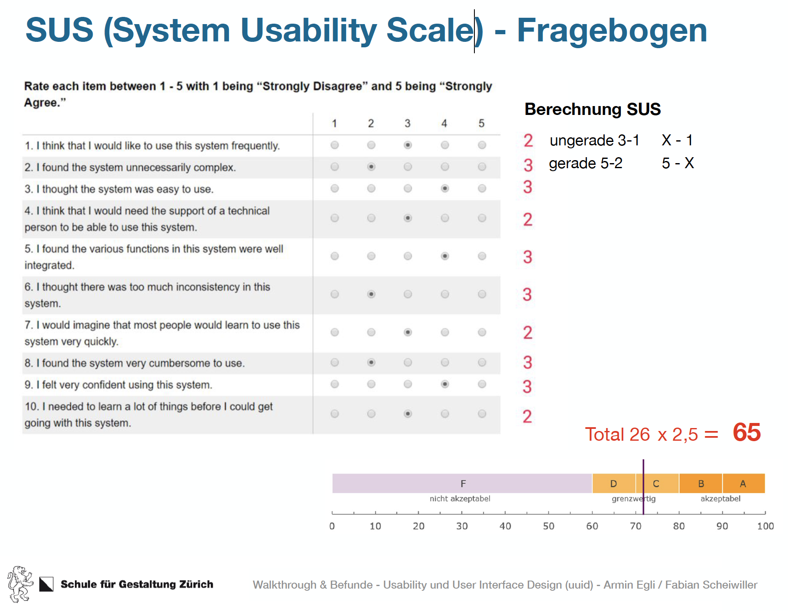

# Testing HiFi
**Im ersten Testing unseres HiFi Prototypen ging es darum herauszufinden ob sich in unserem Design grobe Fehler in der Gestaltung des User-Interface eingeschlichen hatten.**

## Testing Grundsätze

### Wie wird ein Testing erfolgreich durchgeführt?
Grundsätzlich lässt sich ein Testing in 3 Phasen unterteilen. Das Briefing, die Durchführung und das Post-Session Interview. Wichtig ist es die richtigen Fragen zu stellen und der Testperson immer das Gefühl zu geben, dass nicht sie sondern das Produkt getestet wird.

### Wie stelle ich die richtigen Fragen?
Wichtig ist es realistische Situation zu skizzieren und reale Aufgaben stellen. Als testende Person sollte man keine Fragen beantworten sondern diese immer zurückgeben. Zusätzlich darf in eine Frage niemals eine persönliche Meinung hineinfliessen oder ein Hinweis gegeben werden was bei einer Aktion genau passiert.

```html
Was sind gute Fragen?
2. Was sehen Sie hier?
3. Was tun Sie als nächstes?
4. Was erwarten Sie was hier passiert?
5. Ist das passiert, was Sie erwartet haben?
6. Ist das gut oder schlecht?
```

## Briefing und Einleitung

Willkommen Herr/Frau Muster, ich heisse Severin Kilchhofer. Ich bin der Testleiter und begleite sie in den kommenden Viertelstunde. Danke,dass Sie sich Zeit nehmen für den Test. Wir schätzen das sehr. Die Testsitzung ist folgendermassen aufgebaut:

1. Nach dem Briefing stelle ich Ihnen ein paar Fragen zur ihrer Erfahrung mit ähnlichen Produkten.

2. Danach bitte ich Sie 1-2 Aufgaben durchzuführen.

3. Danach besprechen wir die gemachten Aufgaben zusammen im Postesession-Interview.

* Bitte denken Sie während der Aufgaben laut, beschreiben Sie, was Sie sehen und wonach sie suchen.
* Ihre Kommentare sind sehr wertvoll für uns. Bitte seien Sie ganz offen und sagen Sie uns ihre ungeschminkte Meinung. Beides – Gutes und weniger Gutes.
* Bitte denken Sie daran, wir testen die Software und nicht Sie als Benutzer.
* Ist es ok für Sie, dass wir die Session aufzeichnen?
* Die Session dauert ca. 15 Minuten.
* Haben Sie noch Fragen bevor wir beginnen?


### Person 3 Testing

**1. Was erwartest du wenn du dich anmeldest?**

Ich kann mich dort anmelden, oder mich mit Socialmedia einloggen. Screen ist klar.

**2. Eventsite**

Ich komme zu einer Übersicht mit Events, und sehe bei welchen Events ich teilneheme. 

**2. Wenn ich eine Gruppe sehe, wie komme ich wieder weg von diesem Screen.**

Mir ist nicht klar wie ich zwischen den Elementen switchen kann. Warum ist es verschwommen? (Card wird nicht erkannt). Icon auf Bild ist problematisch.

**3. Gruppen Screen / erstellen**

Mir ist nicht klar ob das ein Secondary-Button ist oder ob dieser inaktiv ist. Der Name der Gruppe ist nicht ganz klar – machen die nur Biologie im Park? (Wording-Problem)

**4. Du würdest gerne deine Daten anpassen.**

Wird einfach gefunden unter Profil bearbeiten.

**5. Dir werden Gruppen vorgeschlagen. Und du möchtest deine Preferenzen ändern damit dir andere Gruppen vorgeschlagen werden. Wo würdest du das machen?**

Wird erkannt unter Profil.

**6. Wo würdest du dich abmelden.**

Ist unklar, wird nicht erkannt. Abmelden geht unter, sollte als Button gekennzeichnet sein laut Testperson.

**6. Card Design**

Navigationselement ist unklar. Es geht unter auf diesem Screen, es sollte besser ersichtlich sein.

**7. Feedback bei Teilnahme**

Teilnahme Button macht Sinn, jedoch erscheint das Feedback am falschen Ort. Es sollte dort Feedback geben wo die interaktion erfolgt.

**8. Vergangene Events**

Wirkt inaktiv und es ist nicht klar dass diese angeaschaut werden können. 

**9. Was würdest du noch wünschen**
Feedback bei Gruppenbeitritt.

## Post Session Interview & EMO Cards
### Personal
* Sicherlich nützlich für jemanden der neu in der Stadt ist und gerne in der Gruppe lernt.
### Fast
* Sehr einfache und aufgeräumte Navigation durch den Prototype.
### Hard to Use
* Nicht die ganze App ist Hard to Use, Card Design hat zu viele Elemente, Drop nicht klar. Navi braucht es nicht, Ebene zu tief.
### Clear
* Aufteilung ist gut, und Signalfarbe wird sehr gut eingesetzt!


## SUS Fragebogen 
Punkte 33 x 2.5 = 85 = Accepted, sogar verbessert um 2.5 Punkte im Vergleich zum LowFi-Prototype.


