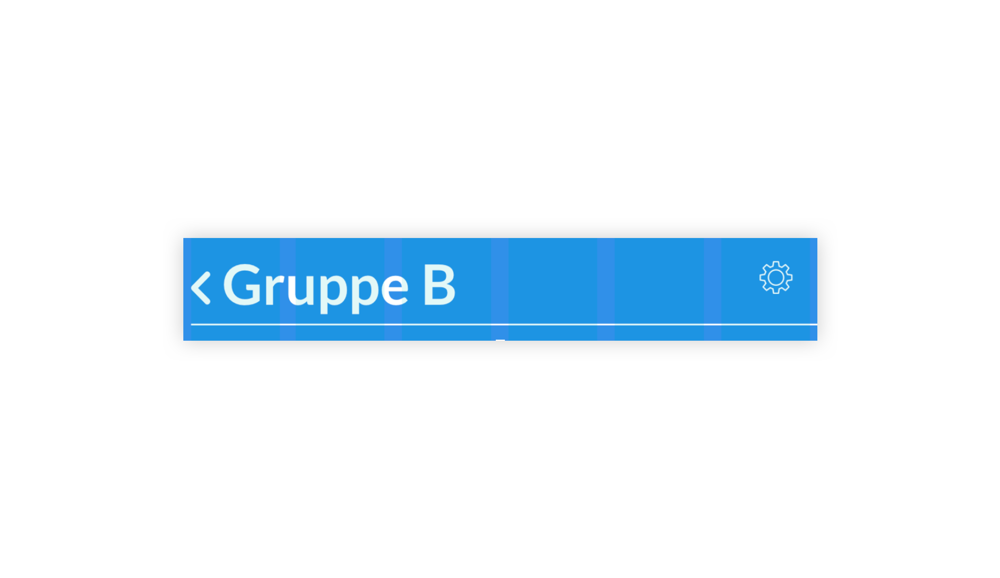
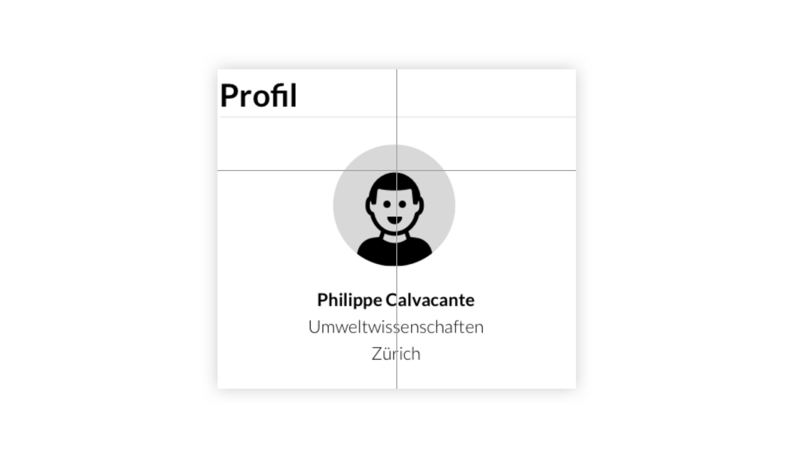
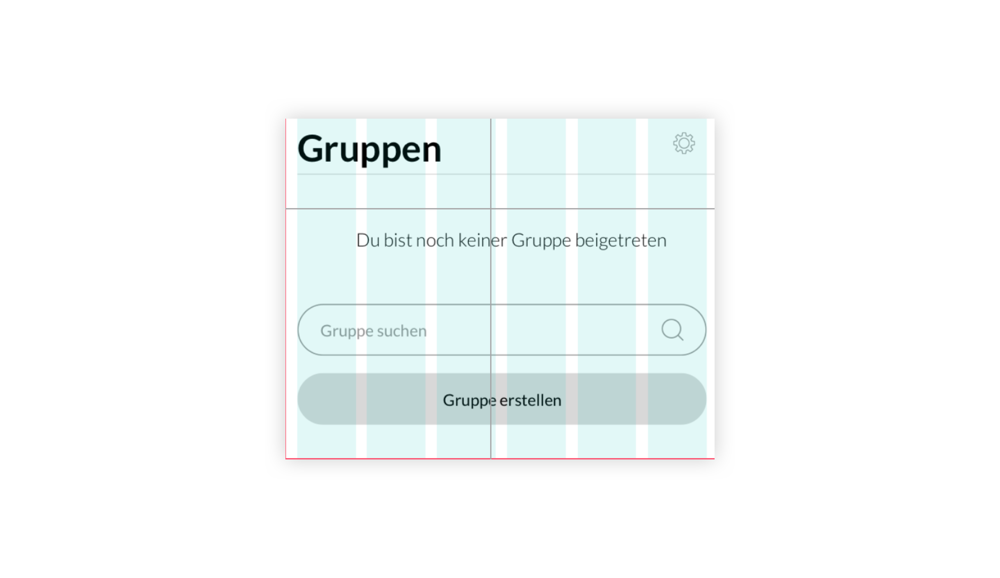
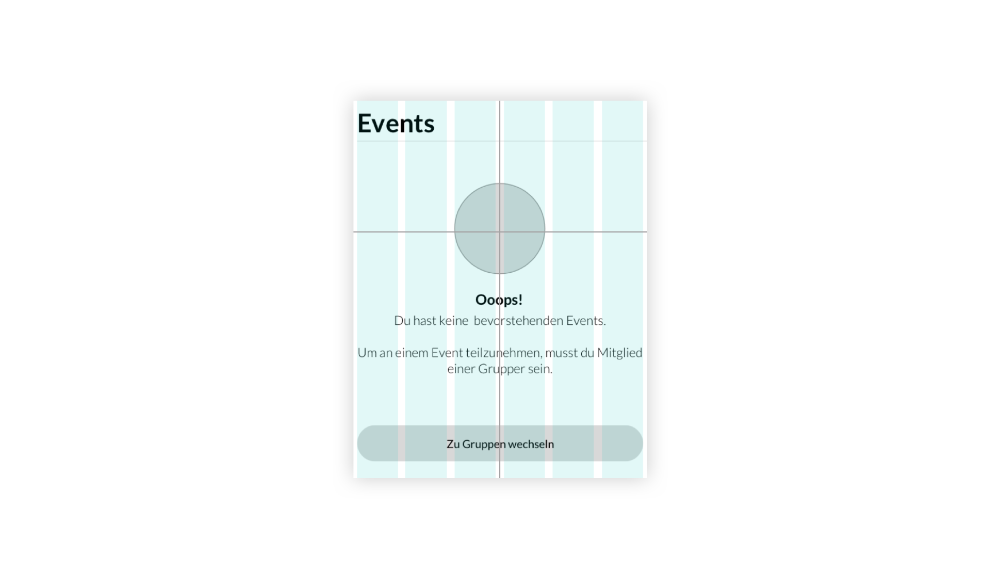

# Erkenntnisse Testing

**Folgende Fehler sind während dem LowFi-Testing ausfindig gemacht worden.**

## Einstellungen

Die Eisntellungen werden als unnötig emfpunden. Es ist nicht klar wofür diese zuständig sind, da unten das Profil immer erreichbar ist.

## Profilbild

Dem User war nicht klar ob er das Profilbild bearbeiten kann oder nicht. Eine Lösung könnte ein Bearbeiten-Icon sein.

## Gleiche Bedeutung

Dem User war der Unterschied zwischen Suche und Secondary-Button nicht klar. Die Lösung für dieses Problem kann im Design erarbeitet werden.

## Wording

Das eher strenge Wording auf dieser Seite verunsicherte den User. Dem User war nicht klar ob er hier einen Fehler gemacht hat.

