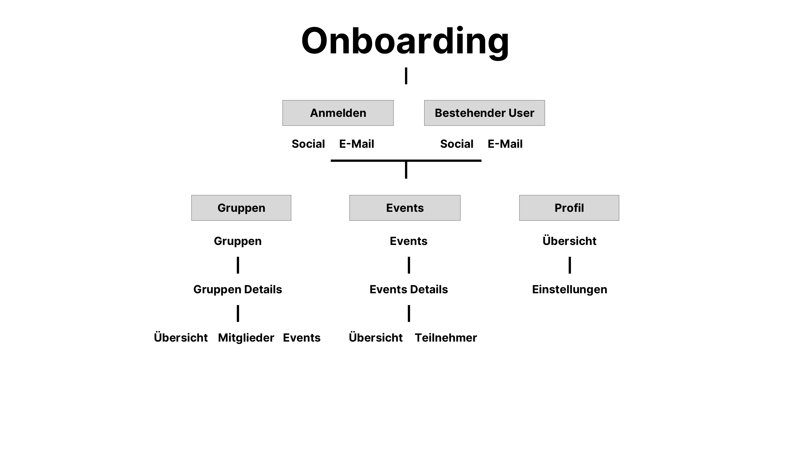
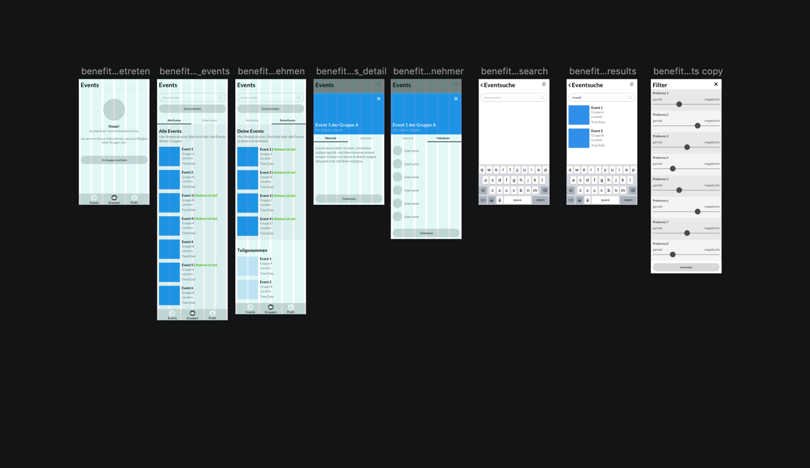

# LowFi
**Mitt den Wireframes oder dem LowFi-Protoype können schon erste User-Testing durchgeführt werden. Somit können in einem frühen Stadium bereits strukturelle Fehlüberlegungen festgestellt werden.**

## Struktur unf Aufbau – Flow Chart

Unser Prototype hat insgesamt 3 Ebenen. Der User kann auf der Hauptstufe zwischen den 3 Hauptpunkten navigieren. Unter jedem Punkt kann der User 1 Stufe tiefer gehen und dort innerhalb einer Card den Content wechseln.

## LowFi Prototype

Folgend ist unser LowFi-Prototype verlinkt. Mittels diesem Wireframe haben wir ein erstes User-Testing durchgeführt und konnten schon erste gravierende Fehler feststellen. 

[Wireframe Prototype](https://notch-interactive.invisionapp.com/share/GKR1N2D6CWU#/screens/352596569_benefit-Onboarding)

