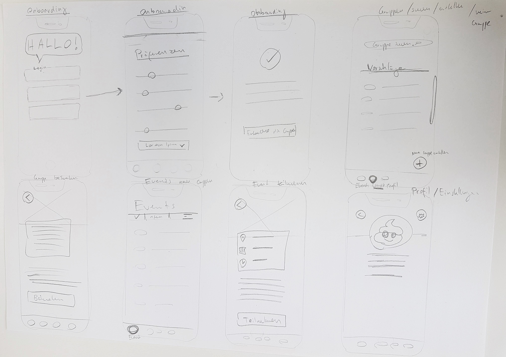
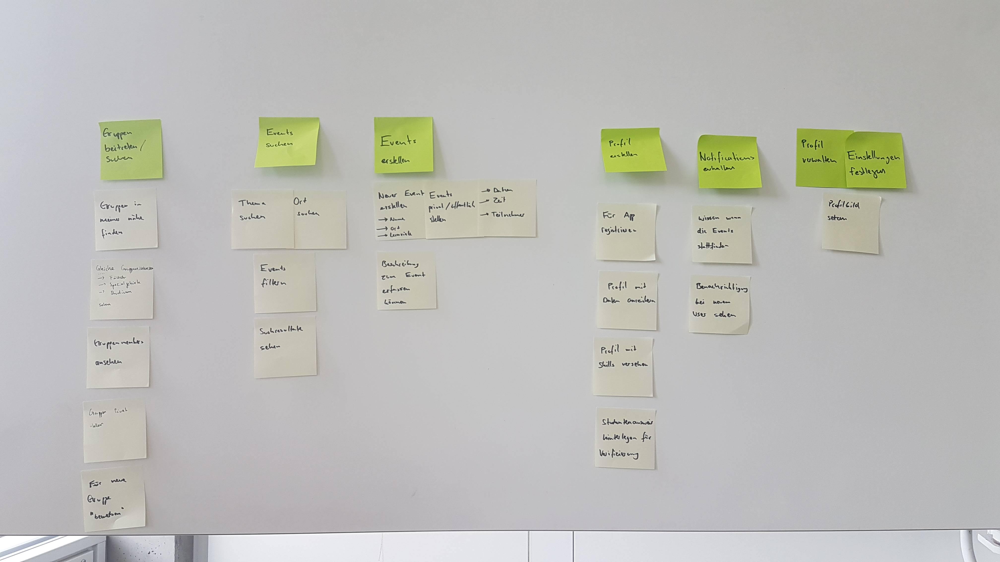

# User-Flow und Requirements
**Der erste Prototype stellt die Basis für unser finales Design dar. Gemeinsam erarbeiteten wir unseren Prototype mittels diversen Vorgehensweisen, welche nachfolgend genauer aufgezeigt werden.**

[Wireframe Prototype](https://notch-interactive.invisionapp.com/share/GKR1N2D6CWU#/screens/352596569_benefit-Onboarding)

## User Flow

Um einen Prototypen zu bauen, müssen zuerst mittels Recherche die Bedürfnisse der User abgeholt werden. Siehe dazu den Punkt „Recherche“ in unserer Dokumentation. Aufgrund dieser Basis haben wir einen User-Flow erstellt und dort festgelegt, was der User genau für Interaktionen ausführen kann. Dadurch konnten wir uns ein ungefähres Bild vom Umfang des Prototypen machen.

## Requirements

Nachdem wir den Groben Userflow bestummen hatten, konnten wir dem User verschiedene Aufgaben zuteilen und diese grob definieren. Dadurch merkten wir relativ schnell welche Epics in der App für uns zentral sein werden. Das Onboarding, die Events, Gruppen und das Profil. Unter jedem von diesen Punkten wurden verschiedenste Interaktionen eingegliedert, dadurch konnten wir den ungefähren Umfang unseres Prototypen abschätzen. 

### Gruppen Beitreten und Suchen
Als User möchte ich Gruppen nach meinen Interessen suchen und vorgeschlagen bekommen. Zusätzlich möchte ich Gruppen einfach erstellen und diese anderen User zugänglich machen. 

### Events Suchen und Erstellen
Als User möchte ich Events nach innerhalb meiner Gruppen suchen und vorgeschlagen bekommen. Zusätzlich möchte ich Events einfach erstellen und diese anderen User in meinen Gruppen zugänglich machen.

### Profil
Als User möchte ich in meinem Profil jederzeit einen Überblick über meine Informationen haben, zusätzlich sollten diese Angaben einfach zu Bearbeiten sein.

### Notifications
Als User möchte ich jederzeit mein Profilbild einfach abändern können.

### Einstellungen
Als User möchte ich in meiner App einfachen Zugang zu den Einstellungen haben. 