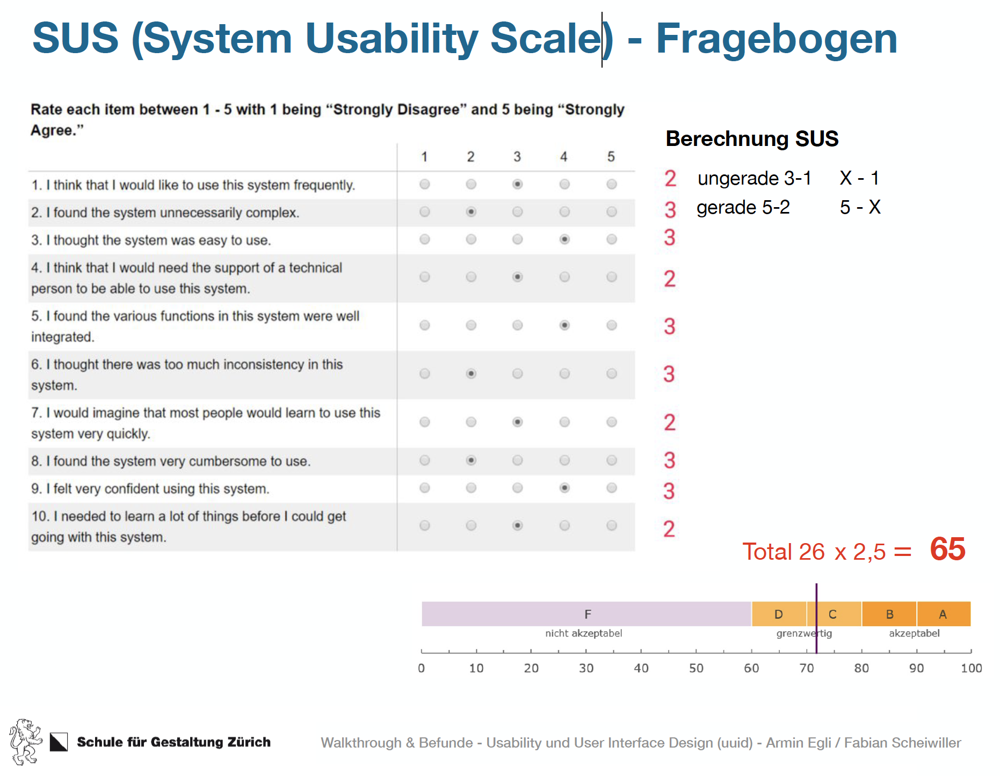

# SUS (System Usability Scale)-Fragebogen

**SUS (System Usability Scale)-Fragebogen dienen dazu ein Testing auszuwerten. Dabei werden bei vorgegebenen zehn Fragen Punkte zwischen 1 bis 5 vergegeben, damit am Ende ein SUS-Score zwischen 0 und 100 entsteht.**

## Vorteile
Ein grosser Vorteil von diesem Fragebogen ist, dass er das Testing in einen greifbaren und messbaren Wert umwandelt. Darucch werden die abstrakten Ergebnisse eines solchen Testings greifbar. 

Wird dieser Test in verschiedenen Phasen der Produktentwicklung wiederholt, kann er auch als Orientierung dienen. Zum Beispiel ist am Resultat ablesbar ob sich das Produkt verbessert hat oder nicht.

